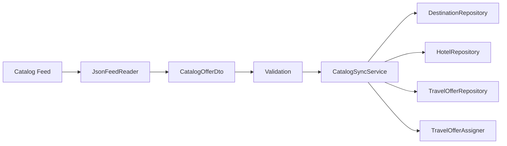
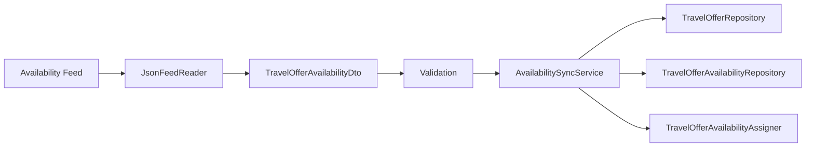
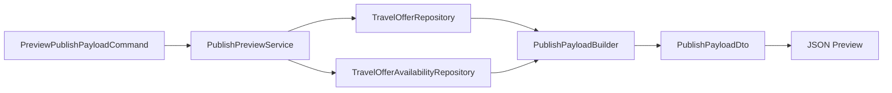

# Travel Pimcore Data Sync Bundle

A standalone minimal Pimcore-oriented bundle package for importing structured travel data, normalizing it into Pimcore Data Objects, and building a publish payload preview.
It is a small public reference project for feed import, validation, data normalization, and publish payload preparation in a Pimcore-based backend workflow.

# What This Shows

- Pimcore-oriented backend structure
- command-driven Symfony workflows
- feed-based data import
- DTO mapping and validation
- repository-based persistence
- relation assignment between Pimcore objects
- publish payload preview from synchronized data

* * *

# Quick Start

## Installation note

This repository is the bundle itself, but the example workflow also depends on Pimcore Data Object class definitions used in the local sandbox setup.

The sandbox Make commands prepare these definitions for local development.

To start the local sandbox:

    make build && make up && make shell

To install the Pimcore Data Object class definitions and seed sandbox data:

    php bin/console travel:sandbox:setup

A host Pimcore project that installs the bundle via Composer must provide or import the required class definitions before the sync commands can run successfully.

## Accessing Pimcore

Once the sandbox is up and running, you can access the instance using the following details:

* **Frontend:** [http://localhost:8080/](http://localhost:8080/)
* **Admin Panel:** [http://localhost:8080/admin/](http://localhost:8080/admin/)
    * **Username:** `admin`
    * **Password:** `admin`

## Run note

Run catalog sync:

    php bin/console travel:sync:catalog

Run availability sync:

    php bin/console travel:sync:availability

Build publish preview:

    php bin/console travel:publish:preview --pretty

* * *

# What to Look At

Key entry points in the codebase:

- `src/Command/SyncCatalogFeedCommand.php` — catalog sync entry point
- `src/Command/SyncAvailabilityFeedCommand.php` — availability sync entry point
- `src/Command/PreviewPublishPayloadCommand.php` — publish preview entry point
- `src/Source/JsonFeedReader.php` — JSON feed reading and row mapping
- `src/Sync/CatalogSyncService.php` — catalog sync orchestration
- `src/Sync/AvailabilitySyncService.php` — availability sync orchestration
- `src/Pimcore/Repository/*` — Pimcore lookup, create, update, folder placement
- `src/Pimcore/Relation/*` — relation assignment
- `src/Publish/PublishPreviewService.php` — payload preview generation
- `src/Publish/PublishPayloadBuilder.php` — downstream payload shaping

* * *

# Architecture

Detailed explanation: `docs/architecture.md`

Design choices and trade-offs: `docs/decisions.md`

* * *

# Developer Workflow

Catalog sync with dry-run:

    php bin/console travel:sync:catalog --dry-run

Availability sync with dry-run:

    php bin/console travel:sync:availability --dry-run

Limit processed records:

    php bin/console travel:sync:catalog --limit=10
    php bin/console travel:sync:availability --limit=10

Preview payload:

    php bin/console travel:publish:preview --limit=10 --pretty

* * *

# Tech Stack

- PHP 8
- Symfony Console
- Symfony Dependency Injection
- Pimcore Data Objects
- JSON feed input
- Docker-based local development support

* * *

# Scope

This repository intentionally does NOT include:

- real HTTP-based supplier integrations
- queue-based processing
- retry handling
- multi-supplier reconciliation
- media ingestion workflows
- direct downstream API delivery

The focus is strictly on the core flow: feed import, validation, normalization into Pimcore, and publish payload preview.
