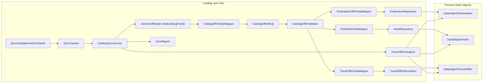
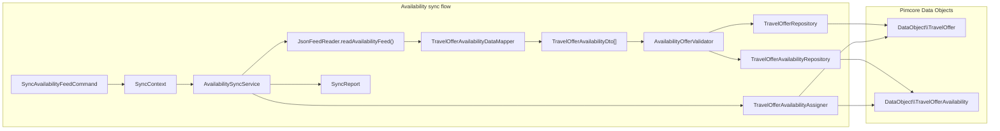

# Architecture

## Sections

- [Overview](#overview)
- [High-level structure](#high-level-structure)
- [Flow diagrams](#flow-diagrams)
    - [Catalog sync flow](#catalog-sync-flow)
    - [Availability sync flow](#availability-sync-flow)
    - [Publish preview flow](#publish-preview-flow)
- [Mapping to the codebase](#mapping-to-the-codebase)
    - [Console commands](#console-commands)
    - [Feed reading](#feed-reading)
    - [Feed DTO mapping](#feed-dto-mapping)
    - [Validation](#validation)
    - [Catalog normalization](#catalog-normalization)
    - [Sync orchestration](#sync-orchestration)
    - [Pimcore persistence](#pimcore-persistence)
    - [Relation linking](#relation-linking)
    - [Publish preview](#publish-preview)
- [How the flows run](#how-the-flows-run)
    - [Catalog sync](#catalog-sync)
    - [Availability sync](#availability-sync)
    - [Publish preview](#publish-preview)
- [Responsibilities by layer](#responsibilities-by-layer)
    - [Commands](#commands)
    - [Source layer](#source-layer)
    - [Mappers](#mappers)
    - [Validators](#validators)
    - [Sync services](#sync-services)
    - [Repositories](#repositories)
    - [Relation assigners](#relation-assigners)
    - [Publish layer](#publish-layer)
- [Boundaries](#boundaries)
- [Why Pimcore fits this use case](#why-pimcore-fits-this-use-case)
- [Delivery model](#delivery-model)
- [Data flow in plain terms](#data-flow-in-plain-terms)
- [Limitations](#limitations)
- [Possible next steps](#possible-next-steps)

This bundle is built around three backend workflows:

- catalog sync
- availability sync
- publish preview

The main idea is simple:

1. read structured travel data from a supplier feed
2. map it into DTOs
3. validate it
4. normalize it into Pimcore Data Objects
5. build a publishable payload from synchronized data

The repository is intentionally small.
It is meant to show a believable Pimcore-oriented backend workflow, not a full travel platform.

---

## High-level structure

The code is split into a few clear parts:

- `Command/` for console entry points
- `Source/` for reading feed input
- `Mapper/` for DTO mapping
- `Validation/` for input checks
- `Sync/` for orchestration
- `Pimcore/Repository/` for persistence
- `Pimcore/Relation/` for relation linking
- `Publish/` for payload building
- `Dto/` and `ValueObject/` for transport and small domain types

This keeps the responsibilities separated without turning the repository into something overly abstract.

---

## Flow diagrams

### Catalog sync flow

### Availability sync flow

### Publish preview flow

```mermaid
flowchart LR

subgraph COMMAND["Console command"]
    A["PreviewPublishPayloadCommand"]
end

subgraph PUBLISH["Publish preview flow"]
    B["PublishPreviewService.buildPreviewAsJson()"]
    C["PublishPreviewService.buildPreviewAsArray()"]
    D["PublishPreviewService.buildPreview()"]
    E["Collect TravelOffer IDs"]
    F["Group availabilities by TravelOffer ID"]
    G["PublishPayloadBuilder.buildFromTravelOffer()"]
end

subgraph REPOSITORIES["Pimcore repositories"]
    H["TravelOfferRepository.findPublishableOffers()"]
    I["TravelOfferAvailabilityRepository.findByTravelOfferIds()"]
end

subgraph MODEL["Pimcore Data Objects"]
    J["DataObject\\TravelOffer[]"]
    K["DataObject\\TravelOfferAvailability[]"]
end

subgraph DTO["Publish payload DTOs"]
    L["PublishTravelPeriodPayloadDto[]"]
    M["PublishPayloadDto[]"]
    N["array[]"]
    O["JSON string"]
end

A --> B --> C --> D
D --> H --> J
D --> E
E --> I --> K
K --> F
J --> G
F --> G
G --> L --> M
M --> N --> O
```

---

## Mapping to the codebase

### Console commands

The bundle starts from console commands:

- `src/Command/SyncCatalogFeedCommand.php`
- `src/Command/SyncAvailabilityFeedCommand.php`
- `src/Command/PreviewPublishPayloadCommand.php`

These are the visible entry points for the three main workflows.

### Feed reading

Feed input is handled by:

- `src/Source/JsonFeedReader.php`

This class reads JSON files, decodes them, filters rows, and maps them into feed DTOs.

### Feed DTO mapping

The first mapping step is handled by:

- `src/Mapper/CatalogOfferDataMapper.php`
- `src/Mapper/TravelOfferAvailabilityDataMapper.php`

These classes map raw supplier rows into:

- `src/Dto/CatalogOfferDto.php`
- `src/Dto/TravelOfferAvailabilityDto.php`

### Validation

Feed DTO validation is handled by:

- `src/Validation/CatalogOfferValidator.php`
- `src/Validation/AvailabilityOfferValidator.php`
- `src/Validation/ValidationResult.php`

This keeps basic input checks out of repositories and out of raw feed reading.

### Catalog normalization

For catalog sync, a valid `CatalogOfferDto` is mapped further into narrower DTOs:

- `src/Mapper/DestinationOfferDataMapper.php`
- `src/Mapper/HotelOfferDataMapper.php`
- `src/Mapper/TravelOfferDataMapper.php`

These produce:

- `src/Dto/DestinationDto.php`
- `src/Dto/HotelDto.php`
- `src/Dto/TravelOfferDto.php`

### Sync orchestration

The main orchestration lives in:

- `src/Sync/CatalogSyncService.php`
- `src/Sync/AvailabilitySyncService.php`
- `src/Sync/SyncContext.php`
- `src/Sync/SyncReport.php`

These classes coordinate the flow and collect sync results.

### Pimcore persistence

Pimcore persistence is handled through repositories:

- `src/Pimcore/Repository/DestinationRepository.php`
- `src/Pimcore/Repository/HotelRepository.php`
- `src/Pimcore/Repository/TravelOfferRepository.php`
- `src/Pimcore/Repository/TravelOfferAvailabilityRepository.php`

These repositories contain lookup, create, update, and folder placement logic.

### Relation linking

Relations are linked by:

- `src/Pimcore/Relation/TravelOfferAssigner.php`
- `src/Pimcore/Relation/TravelOfferAvailabilityAssigner.php`

These are kept separate from the repositories so the flow stays easier to follow.

### Publish preview

The publish preview flow is handled by:

- `src/Publish/PublishPreviewService.php`
- `src/Publish/PublishPayloadBuilder.php`
- `src/Dto/PublishPayloadDto.php`
- `src/Dto/PublishTravelPeriodPayloadDto.php`

This part reads synchronized Pimcore objects and builds a simpler downstream-friendly JSON shape.

---

## How the flows run

### Catalog sync

Catalog sync starts in `SyncCatalogFeedCommand`.

The command validates input options, builds a `SyncContext`, and calls `CatalogSyncService`.

`CatalogSyncService` then:

1. reads the catalog feed through `JsonFeedReader`
2. gets back a list of `CatalogOfferDto` objects
3. validates each DTO
4. maps a valid entry into:
    - `DestinationDto`
    - `HotelDto`
    - `TravelOfferDto`
5. creates or updates Pimcore objects through the repositories
6. links the final `TravelOffer` to its `Destination` and `Hotel`
7. updates the `SyncReport`

This is the main normalization flow in the bundle.

### Availability sync

Availability sync starts in `SyncAvailabilityFeedCommand`.

The command builds a `SyncContext` and calls `AvailabilitySyncService`.

`AvailabilitySyncService` then:

1. reads the availability feed through `JsonFeedReader`
2. gets back a list of `TravelOfferAvailabilityDto` objects
3. validates each DTO
4. finds the matching `TravelOffer`
5. creates or updates `TravelOfferAvailability`
6. links the availability record back to the parent `TravelOffer`
7. updates the `SyncReport`

This flow is intentionally separate from catalog sync.

### Publish preview

Publish preview starts in `PreviewPublishPayloadCommand`.

The command calls `PublishPreviewService`, which:

1. loads publishable travel offers
2. collects their IDs
3. loads related availability records in bulk
4. groups availability by travel offer
5. uses `PublishPayloadBuilder` to build a payload DTO per offer
6. converts payload DTOs to arrays
7. encodes the result as JSON

This flow does not push data anywhere.
It only shows how synchronized Pimcore data can be prepared for downstream use.

---

## Responsibilities by layer

### Commands

Commands are intentionally thin.

They validate CLI input, build context objects, call services, and render output.

### Source layer

The source layer is responsible for reading input data from files and turning it into rows that can be mapped.

### Mappers

The mappers do two different jobs:

- feed mappers turn raw rows into feed DTOs
- catalog mappers turn valid catalog DTOs into narrower DTOs for persistence

### Validators

Validators check whether a mapped feed DTO is usable before the sync continues.

### Sync services

The sync services hold the main workflow logic.
They are the place where reading, validation, mapping, persistence, relation assignment, and reporting come together.

### Repositories

Repositories hide Pimcore-specific persistence details and keep them out of the orchestration code.

### Relation assigners

Assigners only deal with linking already resolved Pimcore objects.

### Publish layer

The publish layer reads synchronized data and shapes it into a payload format that would be suitable for another system.

---

## Boundaries

This bundle keeps a few boundaries explicit:

- feed input is separate from Pimcore persistence
- validation is separate from mapping
- mapping is separate from repository logic
- relation linking is separate from object creation and updates
- publish shaping is separate from sync logic

None of these boundaries are especially fancy, but together they make the code easier to read and easier to explain.

That matters more here than building something overly generic.

---

## Why Pimcore fits this use case

Pimcore is used here as a structured data layer for travel content.

That fits the problem well because the bundle deals with:

- destinations
- hotels
- travel offers
- travel periods
- relations between them

The point is not to show Pimcore as a frontend or booking engine.

The point is to show a backend use case where Pimcore works naturally as the internal model for normalized travel data.

---

## Delivery model

The bundle uses a simple command-driven execution model.

That means:

- a user starts the flow explicitly from the console
- the sync runs synchronously
- publish preview works from already synchronized Pimcore data

There is no queue, scheduler, or async worker in this repository.

That is intentional.
For this project, a simpler execution model makes the structure easier to understand.

---

## Data flow in plain terms

The data moves through a few clear stages:

1. supplier JSON rows
2. feed DTOs
3. validated entries
4. narrower persistence DTOs
5. Pimcore Data Objects
6. publish payload DTOs
7. JSON preview output

This helps keep the external feed format, the internal Pimcore model, and the downstream payload format separate.

---

## Limitations

This repository intentionally leaves out a number of things that a larger production system might need.

It does not include:

- real HTTP-based supplier integrations
- authentication for external systems
- retries or backoff handling
- queue-based processing
- advanced reconciliation across multiple suppliers
- asset download and import for media
- structured observability and metrics
- direct downstream API delivery
- advanced Pimcore admin customization

That is not an accident.
The repository is focused on the core backend flow, not on covering every possible concern.

---

## Possible next steps

If this bundle were extended further, reasonable next steps could be:

- add HTTP-based supplier integrations alongside file-based feeds
- add scheduled command execution
- add richer validation and validation reporting
- add media ingestion for hotel images
- add supplier mapping and reconciliation rules
- add downstream export or API handoff
- add smoke tests against a sandbox Pimcore setup
- add more payload variants for different downstream consumers

These are natural extensions, but they are outside the current scope of the repository.
